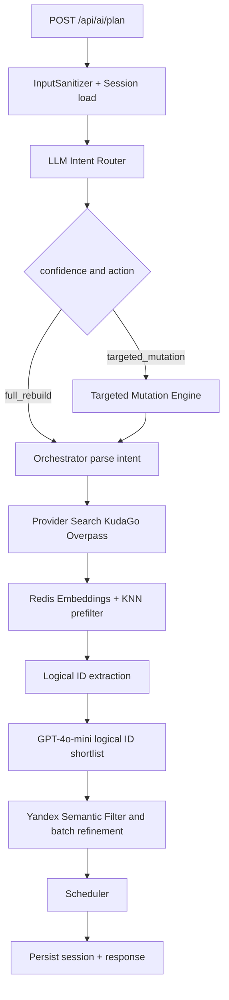

# Dual-AI Engine: технический план внедрения в `travel-planner`

## 1. Scope и текущая база

Область этой спецификации ограничена backend AI pipeline в `apps/api/src/ai/**`.

Проверенная текущая реализация:
- Контрольный поток и feature flags сосредоточены в `apps/api/src/ai/ai.controller.ts`.
- Контракты pipeline и meta-диагностики — `apps/api/src/ai/types/pipeline.types.ts`.
- Роутинг интентов в shadow-режиме — `apps/api/src/ai/pipeline/intent-router.service.ts`.
- Logical ID пока только диагностический — `apps/api/src/ai/pipeline/logical-id-filter.service.ts`.
- Vector prefilter пока shadow-healthcheck без embeddings/KNN — `apps/api/src/ai/pipeline/vector-prefilter.service.ts`.
- Provider сборка и pre-filter — `apps/api/src/ai/pipeline/provider-search.service.ts`.
- Yandex batch refinement уже есть как optional пост-этап — `apps/api/src/ai/pipeline/yandex-batch-refinement.service.ts`.
- Текущее поведение сильно завязано на флаги в `.env.example`.
- Контрактные тесты централизованы в `apps/api/src/ai/ai.controller.spec.ts`.

Подтверждённое продуктовое решение для этой миграции: новые поля `meta` в `POST /api/ai/plan` становятся обязательными по умолчанию для всех клиентов.

---

## 2. Целевая архитектура после миграции



Ключевой принцип: убрать shadow/legacy-ветвление из runtime control flow и перевести pipeline в единый active mode с fallback по ошибкам интеграций, а не по флагам.

---

## 3. Фазовый план реализации

## Фаза 1. Де-флаггинг legacy/shadow и перевод в active mode

### Файлы
- `apps/api/src/ai/ai.controller.ts`
- `apps/api/src/ai/types/pipeline.types.ts`
- `apps/api/src/ai/ai.controller.spec.ts`
- `.env.example`
- `docs/prd/dual_ai_engine_prd.md`

### Изменения DTO/types/контрактов
- `PlannerVersion`: удалить `legacy` и `v2-shadow`, оставить один активный вариант (рекомендуемо `v2`).
- Удалить shadow-суффиксы в meta-типах, где они больше не соответствуют поведению.
- `PlanResponseContractMeta`: сделать поля нового контракта всегда присутствующими, без gate `FF_PLANNER_V2_CONTRACT_FIELDS`.
- Сохранить backward-compatible старые ключи latency/counts в `meta` до конца полной миграции фронта:
  - `steps_duration_ms.yandex_fetch`
  - `poi_counts.yandex_raw`

### Риски совместимости
- Клиенты, ожидающие отсутствие новых `meta` полей, могут падать на строгих схемах.
- Тесты, привязанные к `v2-shadow`, будут ломаться.
- Ops-пайплайн, где флаги использовались как switch, потеряет ручной rollback через env.

### Тесты
- Unit: обновить проверки `resolvePlannerVersion`-поведения и meta shape в `ai.controller.spec.ts`.
- Integration: контрактный тест `POST /ai/plan` с обязательными `planner_version` и `pipeline_status`.
- E2E: smoke-сценарий планирования с проверкой обязательного `meta` блока.

---

## Фаза 2. LLM Intent Router + fallback low confidence

### Файлы
- `apps/api/src/ai/pipeline/intent-router.service.ts`
- `apps/api/src/ai/types/pipeline.types.ts`
- `apps/api/src/ai/ai.controller.ts`
- `apps/api/src/ai/pipeline/intent-router.service.spec.ts`
- `apps/api/src/ai/ai.controller.spec.ts`

### Изменения DTO/types/контрактов
- `IntentRouterDecision`: закрепить как always-on часть `meta.intent_router`.
- Расширить `fallback_reason` при необходимости (сохраняя `LOW_CONFIDENCE` как базовый).
- Формализовать confidence-threshold в одном месте и покрыть тестами.

### Риски совместимости
- Неправильная классификация intent приведёт к нежелательному full rebuild.
- Агрессивный threshold может деградировать UX targeted-редактирования.

### Тесты
- Unit: матрица интентов remove/replace/add/global/new + проверки confidence guard.
- Integration: контроллер возвращает стабильный `meta.intent_router` для всех запросов.
- E2E: сценарий «низкая уверенность -> full_rebuild + fallback_reason=LOW_CONFIDENCE».

---

## Фаза 3. Targeted mutations: `REMOVE_POI`, `REPLACE_POI`, `ADD_DAYS`

### Файлы
- `apps/api/src/ai/ai.controller.ts`
- `apps/api/src/ai/pipeline/intent-router.service.ts`
- `apps/api/src/ai/types/pipeline.types.ts`
- `apps/api/src/ai/ai-sessions.service.ts`
- `apps/api/src/ai/pipeline/scheduler.service.ts`
- `apps/api/src/ai/ai.controller.spec.ts`

### Изменения DTO/types/контрактов
- Уточнить модель входа для mutation path: использовать текущий план из последнего assistant-сообщения в сессии.
- Дополнить тип результата маршрутизации полями mutation diagnostics при необходимости:
  - `applied_mutation`
  - `mutation_result`
- Обязательное поведение:
  - `REMOVE_POI`: исключить выбранный POI и пересобрать day slots локально.
  - `REPLACE_POI`: заменить точку на семантически близкую из candidate pool.
  - `ADD_DAYS`: увеличить горизонт дней и перераспределить/добавить POI.

### Риски совместимости
- Если в истории нет валидного `RoutePlan`, mutation path должен детерминированно откатываться в full rebuild.
- Ошибка target resolution может удалить/заменить не ту точку.

### Тесты
- Unit: отдельные тесты на каждую мутацию и id resolution.
- Integration: цепочка session history -> mutation -> новый `route_plan` без потери структуры.
- E2E: chat-edit сценарии с несколькими последовательными мутациями.

---

## Фаза 4. Redis embeddings + RediSearch KNN vector prefilter

### Файлы
- `apps/api/src/ai/pipeline/vector-prefilter.service.ts`
- `apps/api/src/ai/types/pipeline.types.ts`
- `apps/api/src/ai/ai.controller.ts`
- `apps/api/src/redis/redis.service.ts`
- `.env.example`
- `apps/api/src/ai/pipeline/vector-prefilter.service.spec.ts`

### Изменения DTO/types/контрактов
- Перевести `runShadowPrefilter` в active-метод, возвращающий реальный subset candidate ids.
- Обновить meta-тип `vector_prefilter`:
  - `status`
  - `top_k`
  - `selected_count`
  - `fallback_reason`
  - опционально `knn_latency_ms`
- Добавить параметры индекса и embedding-пайплайна в env без флаговой семантики.

### Риски совместимости
- При недоступном Redis или индексе риск пустого candidate set.
- Несогласованность dimensionality embeddings и RediSearch schema.

### Тесты
- Unit: успешный KNN путь, missing index, redis down, invalid vector payload.
- Integration: prefilter не ломает downstream даже при fallback.
- E2E: деградационный сценарий без RediSearch с сохранением рабочего ответа.

---

## Фаза 5. Логический ID-отбор через GPT-4o-mini до Yandex этапа

### Файлы
- `apps/api/src/ai/pipeline/logical-id-filter.service.ts`
- `apps/api/src/ai/pipeline/llm-client.service.ts`
- `apps/api/src/ai/ai.controller.ts`
- `apps/api/src/ai/types/pipeline.types.ts`
- `apps/api/src/ai/pipeline/logical-id-filter.service.spec.ts`
- `apps/api/src/ai/ai.controller.spec.ts`

### Изменения DTO/types/контрактов
- Из диагностического `logical_id_shadow` перейти к активному `logical_id_filter` с фактическим shortlist.
- Ввести стабильный контракт shortlist-результата перед Yandex этапом:
  - `total_candidates`
  - `after_logical_dedup`
  - `after_llm_shortlist`
  - `selection_strategy`
- LLM-шаг только выбирает IDs из переданного списка, без генерации новых точек.

### Риски совместимости
- Неверный shortlist может ухудшить релевантность маршрута.
- При LLM ошибке нужен deterministic fallback на non-LLM shortlist.

### Тесты
- Unit: дедуп logical ids, fallback при пустом/битом LLM JSON.
- Integration: порядок шагов `provider -> vector -> logical_id -> yandex`.
- E2E: сравнение стабильности выдачи при повторных запросах.

---

## Фаза 6. Документация, контракты, QA handoff

### Файлы
- `docs/prd/dual_ai_engine_prd.md`
- `docs/tasks/dev-guide.md`
- `README.md`
- `apps/api/src/ai/ai.controller.spec.ts`
- `plans/dual-ai-engine-implementation-plan.md` (этот документ)

### Изменения DTO/types/контрактов
- Зафиксировать финальный контракт `POST /api/ai/plan` с обязательным новым `meta`.
- Явно описать неизменяемые поля для API-совместимости маршрута:
  - `session_id`
  - `route_plan`
  - существующие ключи `meta` legacy-эпохи, если они нужны фронту в переходный период.

### Риски совместимости
- Документация и тесты могут разъехаться с реализацией.
- QA будет валидировать старый контракт, если matrix не обновить.

### Тесты
- Unit: актуализация spec-ожиданий по meta полям.
- Integration: контрактная проверка response schema.
- E2E: регресс-пакет для chat sessions, apply-to-trip, from-trip.

---

## 4. Миграция env: что удалить и что оставить

## Удалить как feature flags
- `FF_PLANNER_V2_ENABLED`
- `FF_PLANNER_V2_CONTRACT_FIELDS`
- `FF_INTENT_ROUTER_V2`
- `FF_POLICY_CALC_V2`
- `FF_LOGICAL_ID_FILTER_V2`
- `FF_VECTOR_PREFILTER_REDIS`
- `FF_DETERMINISTIC_PLANNER_V2`
- `FF_MASS_COLLECTION_V2`
- `FF_YANDEX_BATCH_REFINEMENT`

## Оставить
- `FF_PLANNER_SSE_ENABLED` как endpoint-level beta gate для `GET /api/ai/plan/stream`.

## Оставить как runtime tuning, не флаги
- `AI_VECTOR_TOPK`
- `AI_VECTOR_INDEX_NAME`
- `YANDEX_BATCH_SIZE`
- `YANDEX_BATCH_TIMEOUT_MS`
- ключи интеграций `OPENAI_API_KEY`, `YANDEX_GPT_API_KEY`, `YANDEX_FOLDER_ID`, `REDIS_URL`.

## Как не сломать API контракт
1. Не менять top-level структуру ответа `session_id + route_plan + meta`.
2. Новые поля `meta` сделать обязательными, но legacy-ключи latency/counts оставить на переходный период.
3. Ошибки 422/503 оставить с прежними HTTP кодами и базовыми machine-readable `code` где уже используется.
4. Обновить тесты контракта до деплоя, чтобы любые breaking-изменения ловились CI.

---

## 5. Детализация тестовой стратегии по слоям

## Unit
- Intent Router: классификация и threshold guard.
- Mutation engine: remove/replace/add days и edge-cases без target id.
- Vector prefilter: KNN path + fallback path.
- Logical ID shortlist: deterministic и LLM fallback.

## Integration
- `AiController.plan` полный active flow без feature flags.
- Корректная сборка `meta` на success и fallback.
- Сохранение history в `AiSessionsService` в mutation/full rebuild путях.

## E2E
- Новый маршрут с валидным intent.
- Редактирование существующего маршрута через targeted mutations.
- Деградация при отключённом Redis/ошибке Yandex refinement.
- Совместимость endpoint `sessions/:id/apply` и `sessions/from-trip/:tripId`.

---

## 6. QA handoff template

## 6.1 Acceptance Criteria шаблон

### AC-01 API контракт
- `POST /api/ai/plan` всегда возвращает `meta.planner_version` и `meta.pipeline_status`.
- `route_plan` валиден по прежней структуре days/points.
- `session_id` всегда присутствует.

### AC-02 Intent Router
- Для low-confidence targeted интента выставляется fallback в full rebuild.
- Для явных `REMOVE_POI`/`REPLACE_POI`/`ADD_DAYS` применяется соответствующая мутация.

### AC-03 Vector + Logical stages
- При доступном Redis работает KNN prefilter.
- При недоступности Redis pipeline не падает, а деградирует с диагностикой.
- Перед Yandex этапом используется shortlist по logical IDs.

### AC-04 Надёжность
- Ошибки внешних AI/API не приводят к 500 без контролируемого fallback.
- Повторный одинаковый запрос даёт структурно консистентный ответ.

### AC-05 Контроль регрессий
- `sessions/:id/apply` корректно применяет итоговый план.
- `sessions/from-trip/:tripId` не ломается после изменений pipeline.

## 6.2 Curl test matrix шаблон

> Ниже шаблон для QA без выполнения в рамках этой подзадачи.

```bash
# T1: baseline full rebuild
curl -X POST "$API_URL/api/ai/plan" \
  -H "Authorization: Bearer $TOKEN" \
  -H "Content-Type: application/json" \
  -d '{"user_query":"2 дня в Казани, музеи и парки"}'

# T2: targeted REMOVE_POI
curl -X POST "$API_URL/api/ai/plan" \
  -H "Authorization: Bearer $TOKEN" \
  -H "Content-Type: application/json" \
  -d '{"session_id":"$SESSION_ID","user_query":"Удали точку poi_id=abc123"}'

# T3: targeted REPLACE_POI
curl -X POST "$API_URL/api/ai/plan" \
  -H "Authorization: Bearer $TOKEN" \
  -H "Content-Type: application/json" \
  -d '{"session_id":"$SESSION_ID","user_query":"Замени точку poi_id=abc123 на что-то семейное"}'

# T4: targeted ADD_DAYS
curl -X POST "$API_URL/api/ai/plan" \
  -H "Authorization: Bearer $TOKEN" \
  -H "Content-Type: application/json" \
  -d '{"session_id":"$SESSION_ID","user_query":"Добавь еще 1 день"}'

# T5: NEED_CITY validation
curl -X POST "$API_URL/api/ai/plan" \
  -H "Authorization: Bearer $TOKEN" \
  -H "Content-Type: application/json" \
  -d '{"user_query":"сделай маршрут"}'

# T6: fallback when vector infra unavailable
curl -X POST "$API_URL/api/ai/plan" \
  -H "Authorization: Bearer $TOKEN" \
  -H "Content-Type: application/json" \
  -d '{"user_query":"3 дня в Москве, без ресторанов"}'

# T7: apply generated plan to trip
curl -X POST "$API_URL/api/ai/sessions/$SESSION_ID/apply" \
  -H "Authorization: Bearer $TOKEN" \
  -H "Content-Type: application/json" \
  -d '{}'
```

Проверки для каждого теста:
- HTTP status
- обязательные поля ответа
- корректность `meta.pipeline_status`
- наличие диагностических причин fallback при деградации
- консистентность `route_plan.days[].points[]`

---

## 7. Порядок внедрения с минимальным риском регрессий

1. Сначала стабилизировать контракт тестами, затем удалять флаги.
2. Переводить shadow-слои в active по одному этапу с fallback-first поведением.
3. После каждого этапа фиксировать контрактные снапшоты `ai.controller.spec.ts`.
4. Не менять одновременно mutation path и vector/logical отбор в одном PR.
5. Финально синхронизировать документацию и QA matrix в том же релизном цикле.
