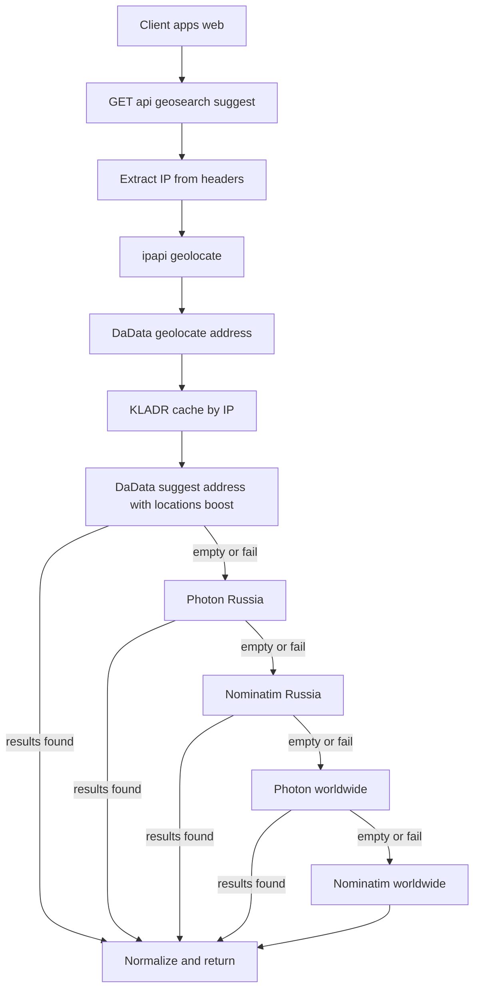

# План восстановления интеграции DaData в backend

## Контекст
- Политика backend-only обязательна: [`backend-only-external-api-policy.md`](../docs/architecture/backend-only-external-api-policy.md)
- Публичный клиентский контракт должен остаться через `GET /api/geosearch/suggest`
- Восстановление нужно выполнить только в `apps/api`, без возврата route в `apps/web/src/app/api/**`

## Цель
Восстановить полный пайплайн геоподсказок в Nest backend:
1. DaData как основной провайдер
2. geolocate по IP
3. locations_boost по KLADR
4. fallback на Photon и Nominatim
5. единый нормализованный ответ `{ displayName, uri }[]`

## Изменяемые файлы
- [`apps/api/src/geosearch/geosearch.controller.ts`](../apps/api/src/geosearch/geosearch.controller.ts)
- [`apps/api/src/geosearch/geosearch.service.ts`](../apps/api/src/geosearch/geosearch.service.ts)
- [`apps/api/src/geosearch/geosearch.module.ts`](../apps/api/src/geosearch/geosearch.module.ts)
- [`apps/api/src/main.ts`](../apps/api/src/main.ts) только если потребуется `trust proxy` для корректного IP
- [`/.env.example`](../.env.example)
- Документация при необходимости в [`docs/tasks/dev-guide.md`](../docs/tasks/dev-guide.md)

## Архитектурный подход

## Шаги реализации
1. Создать отдельную ветку от текущей базы:
   - `fix/restore-dadata-backend-geosearch`
2. В `geosearch.controller` добавить доступ к заголовкам запроса и передавать `ip` в сервис.
3. В `geosearch.service` добавить:
   - извлечение ключей `DADATA_API_KEY`, `DADATA_SECRET_KEY`, `YANDEX_*`
   - `getUserCoordsByIp` через `ipapi.co`
   - `getKladrByCoords` через DaData geolocate endpoint
   - in-memory cache `IP -> KLADR + coords + timestamp`
   - `getDadataSuggestions` с `locations_boost`
   - fallback-цепочку `DaData -> Photon RU -> Nominatim RU -> Photon WW -> Nominatim WW`
   - нормализацию ответа в единый формат
4. Оставить frontend без изменений по маршруту suggest:
   - не добавлять `apps/web/src/app/api/suggest/route.ts`
   - убедиться, что frontend вызывает backend endpoint
5. Обновить `.env.example`:
   - добавить `DADATA_API_KEY`
   - добавить `DADATA_SECRET_KEY`
   - сохранить существующие ключи Yandex
6. Выполнить валидацию:
   - локальная сборка/линт API
   - ручной запрос `GET /api/geosearch/suggest?q=Москва`
   - проверка fallback на случай недоступности DaData
7. Подготовить итог: список изменений, команды проверки, риски.

## Инварианты для ревью
- Нет внешних geocode fetch в `apps/web/src/**`
- Нет suggest route в `apps/web/src/app/api/**`
- Все провайдеры вызываются только из `apps/api/src/geosearch/**`
- Публичная точка входа: `GET /api/geosearch/suggest`

## Риски и контроль
- Риск лимитов DaData и `ipapi` решается fallback цепочкой.
- Риск неверного IP за прокси решается корректной обработкой `x-forwarded-for`.
- Риск деградации ответов снижается единым контрактом нормализации.
