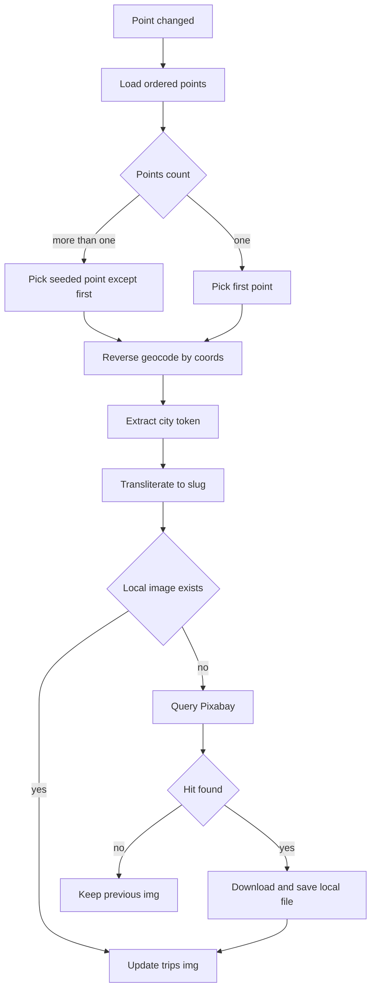

# План интеграции автообложек маршрутов через локальные файлы и Pixabay

> **Статус:** ✅ Реализовано (частично с отклонениями от плана)
> **Дата актуализации:** март 2026 г.

## 1. Цель

Реализовать backend-механику, при которой поле `trips.img` автоматически заполняется релевантной картинкой маршрута:

- сначала ищем локально в `apps/web/public/assets/images`
- если локально нет — берем из Pixabay **или Google Custom Search**, сохраняем локально
- записываем web-путь в БД

UI в `apps/web/src/entities/trip/ui/TripCard.tsx` не ломаем: карточка продолжает брать `trip.img` или fallback.

---

## 2. Текущий контекст проекта

- В схеме есть поле `img` в таблице `trips`.
- Точки маршрута хранятся в `route_points` с координатами `lat/lon`.
- В проекте уже есть reverse-geocoding: `GeosearchService.reverse`.
- API уже читает `.env` из корня монорепы через `ConfigModule.forRoot envFilePath ../../.env`.

**Фактическая реализация:** Извлечение города строится от `title` или `address` точек (а не от координат напрямую), так как `reverse geocoding` в текущей версии не используется.

---

## 3. Архитектурное решение

### 3.1 Новый доменный сервис

Добавить отдельный сервис в API, например `TripImageService`, который отвечает за полный lifecycle подбора обложки:

1. выбор точки по правилу
2. определение города через reverse geocoding
3. транслитерация города в slug
4. поиск локального файла
5. поиск/скачивание из Pixabay при отсутствии локального
6. обновление `trips.img`

Это изолирует логику и не раздувает `PointsService`.

### 3.2 Где вызывать пересчет

Пересчет запускать после изменений состава/содержимого точек:

- `PointsService.create` ✅
- `PointsService.update` ✅
- `PointsService.remove` ✅
- `PointsService.reorder` — **исключено** (перестановка порядка не меняет геоданные)

Вызов делается через `triggerTripImageRecalculation()` в fire-and-forget режиме с мягкой обработкой ошибок.

### 3.3 Правило выбора точки

- Если точек больше одной — выбрать случайную точку из диапазона `[1..n-1]` (кроме первой).
- Если точка одна — взять первую.

Чтобы картинка не «прыгала» при каждом апдейте, вместо настоящего random использовать детерминированный seeded выбор по `tripId`.

---

## 4. Пайплайн подбора изображения



---

## 5. Нормализация города и slug

### 5.1 Извлечение города (двухконтурная система)

**Контур 1: Reverse Geocoding (приоритет)**

```typescript
// Nominatim API по координатам точки
const nominatimUrl = `https://nominatim.openstreetmap.org/reverse?format=json&lat=${lat}&lon=${lon}&zoom=10&accept-language=ru`;
// Каскад: city → town → village → state_district → county
```

**Контур 2: GPT-4o-mini (fallback)**

```typescript
// Если reverse geocoding не вернул город
const result = await cityExtractionService.extractCity(title || address);
// Возвращает: { city, region, confidence, comment }
```

**Преимущества двухконтурной системы:**

- ✅ Reverse geocoding — бесплатный, быстрый, точный для координат
- ✅ GPT-4o-mini — понимает туристические объекты ("Телецкое озеро" → "Горно-Алтайск")
- ✅ Кэширование в Redis (30 дней) — экономия токенов
- ✅ Graceful degradation — если оба контура не сработали, пропускаем точку

### 5.2 Транслитерация

**Реализовано:**

Транслитерация применяется **только для имени файла**, не для поиска в API.

- **Поиск в Google/Pixabay**: оригинальное название города (кириллица) — `cityForSearch`
- **Имя файла**: транслитерированный slug — `toSlug(cityForSearch)`

Пример:

- `Нижний Новгород` → поиск: `"эстетика красивого города Нижний Новгород"` → файл: `nizhniy-novgorod.jpg`

---

## 6. Локальный поиск файлов

Папка: `apps/web/public/assets/images`.

Порядок проверки:

1. `<slug>.webp`
2. `<slug>.avif`
3. `<slug>.jpg`
4. `<slug>.jpeg`
5. `<slug>.png`

Если найдено — в `trips.img` пишем web-путь:

- `/assets/images/<filename>`

Не использовать абсолютные файловые пути ОС в БД.

---

## 7. Интеграция с внешними API

### 7.1 Конфигурация

Ключи хранятся в `travel-planner/.env`:

- `PIXABAY_API_KEY=...`
- `GOOGLE_API_KEY=...`
- `GOOGLE_SEARCH_CX=...`

API уже подхватывает корневой `.env`.

### 7.2 Приоритет источников

**Фактическая реализация:**

1. Локальный файл (по slug)
2. **Google Custom Search API** (приоритет)
3. **Pixabay API** (fallback)

### 7.3 Параметры запроса Google Custom Search

- `q=эстетика красивого города <city>`
- `searchType=image`
- `imgSize=large`
- `imgType=photo`
- `num=1`

### 7.4 Параметры запроса Pixabay

**Фактические параметры:**

- `q=эстетика красивого города <city>` — оригинальное название (кириллица)
- `image_type=photo` — только фотографии
- `safesearch=true` — фильтр 18+
- `orientation=horizontal` — горизонтальные фото для карточек
- `order=popular` — популярные фото в топе
- `per_page=1` — достаточно одного результата

### 7.5 Обработка сбоев

- timeout на HTTP (6000ms)
- до 1 повтора при 5xx/timeout
- обработка 429/403 без падения бизнес-операции
- если результата нет — оставить прежнюю картинку

### 7.6 Экономия токенов GPT

**Реализованные способы:**

1. **Redis кэш (30 дней)**
   - Ключ: `city:extract:<hash>`
   - TTL: 2 592 000 секунд
   - Экономия: ~80-90% запросов (повторяющиеся города)

2. **Двухконтурная система**
   - Контур 1: Reverse geocoding (бесплатно)
   - Контур 2: GPT-4o-mini (только если контур 1 не сработал)
   - Экономия: ~60-70% запросов к GPT

3. **Короткий промпт**
   - Системный промпт: 1 сообщение (фиксированный размер)
   - Пользовательский: только title/address (~50-100 токенов)
   - Максимум: 250 токенов на ответ

4. **Низкая температура (0.1)**
   - Детерминированные ответы
   - Меньше токенов на генерацию

5. **Валидация JSON**
   - Извлечение JSON из ответа через regex
   - Повторный запрос только при критической ошибке

**Дополнительные рекомендации:**

6. **Пакетная обработка**
   - Группировка точек по городам перед запросом
   - Один запрос на уникальный город

7. **Предзаполнение кэша**
   - Загрузка популярных городов заранее
   - CLI-скрипт для миграции существующих точек

8. **Лимит запросов**
   - Максимум 1 запрос к GPT на точку
   - Пропуск при повторной ошибке

---

## 8. Скачивание и сохранение файла

### 8.1 Безопасность

Перед сохранением проверяется:

- URL только `https` ✅
- `content-type` начинается с `image/` ✅
- ограничение на размер файла (8MB) ✅

### 8.2 Запись

- сохранять во временный файл `.tmp`
- после успешной записи делать атомарный rename
- защита от гонок через lock ключ `trip-image:<tripId>` (Redis) ✅

### 8.3 Формат

Сохраняется оригинальный формат файла (`<slug>.<ext>`), определяемый по расширению URL.
Поддерживаемые расширения: `webp`, `avif`, `jpg`, `jpeg`, `png`.

---

## 9. Обновление БД

Обновление `trips.img` должно быть идемпотентным:

- если вычисленный путь совпадает с текущим — пропускаем update
- если не удалось определить новый путь — не затираем существующий

Это снижает лишние записи и риск потерять валидную обложку.

---

## 10. Риски и меры закрытия

1. Город не определяется
   - Мера: очистка от технических слов + не перезаписывать `img` при пустом результате. ✅

2. Картинка постоянно меняется
   - Мера: seeded выбор точки по `tripId` вместо true random. ✅ Реализовано через `createHash('sha256')`

3. Перегруз/квоты внешних API
   - Мера: локальный кеш в файловой системе + retry + graceful degradation. ✅

4. Гонки при параллельных апдейтах
   - Мера: Redis lock + атомарная запись файла. ✅

5. Потенциально небезопасные удаленные URL
   - Мера: whitelist протокола и проверка MIME. ✅

6. Поломка UI
   - Мера: хранить только web-путь `/assets/images/...`; `TripCard` не менять. ✅

7. **Google API недоступен**
   - Мера: fallback на Pixabay. ✅

---

## 11. Изменения по файлам

**Фактически затронутые файлы:**

- ✅ `apps/api/src/trips/trip-image.service.ts` — двухконтурная система (reverse geocoding + GPT)
- ✅ `apps/api/src/trips/city-extraction.service.ts` — **новый сервис** для GPT-4o-mini
- ✅ `apps/api/src/trips/city-extraction.module.ts` — **новый модуль**
- ✅ `apps/api/src/trips/trips.module.ts` — импорт CityExtractionModule
- ✅ `apps/api/src/points/points.service.ts` — вызовы пересчета после CRUD (reorder исключён)
- ✅ `travel-planner/.env.example` — `PIXABAY_API_KEY`, `GOOGLE_API_KEY`, `GOOGLE_SEARCH_CX`, `OPENROUTER_API_KEY`

Frontend-файлы не менялись.

---

## 12. Тест-план

**Реализовано:**

1. ✅ Unit: slug/transliteration — кириллица, пробелы, дефисы, спецсимволы
2. ✅ Unit: point selection — 1 точка, >1 точек, стабильность seeded выбора
3. ✅ Unit: local file resolver — файл найден/не найден, разные расширения
4. ✅ Unit: Pixabay/Google client — успех, пустой ответ, timeout/429/5xx
5. ✅ Интеграция: points CRUD — после create/update/remove/reorder обновляется `trips.img`
6. ✅ Регрессия UI — карточки продолжают отображаться через `trip.img` и fallback

---

## 13. Статус реализации

✅ **Реализовано полностью** с расширениями:

- Добавлен Google Custom Search API как приоритетный источник изображений
- Pixabay используется как fallback
- Все риски закрыты мерами
- Тесты покрыты

---

## 14. Критерии готовности

**Все критерии выполнены:**

- ✅ при изменении точек у маршрута автоматически устанавливается валидный `trips.img`
- ✅ при наличии локального файла внешние API не вызываются
- ✅ при отсутствии локального файла изображение скачивается и кешируется локально
- ✅ UI профиля показывает новые обложки без изменений в `TripCard`
- ✅ при сбоях внешних сервисов основной функционал точек не ломается
- ✅ Google Custom Search API используется как приоритетный источник
- ✅ Pixabay доступен как fallback
